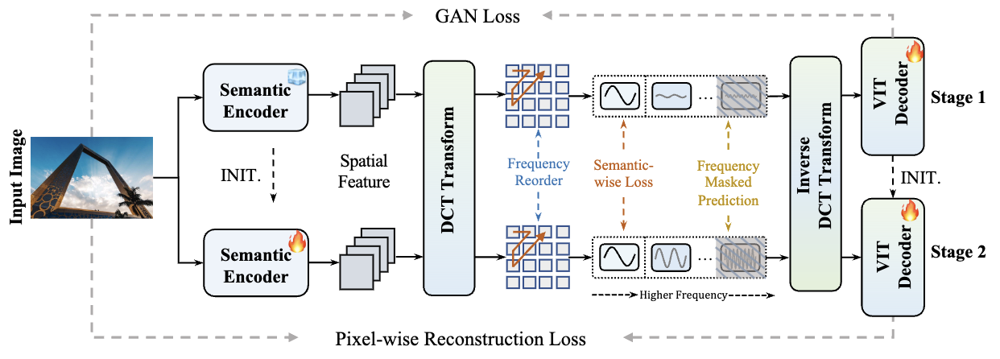
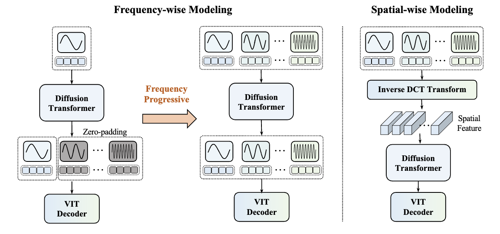
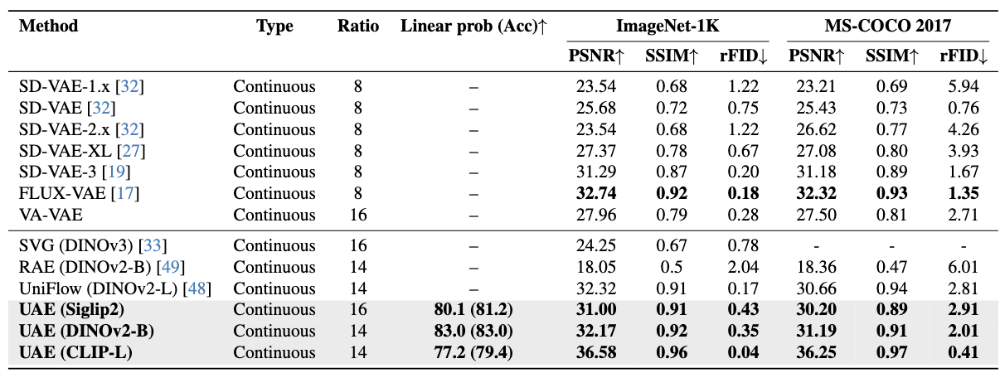
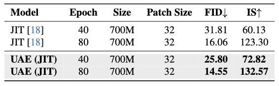
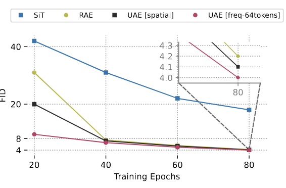
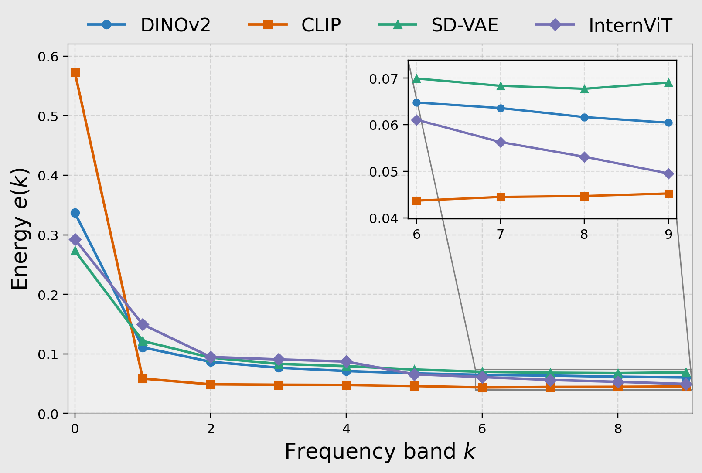
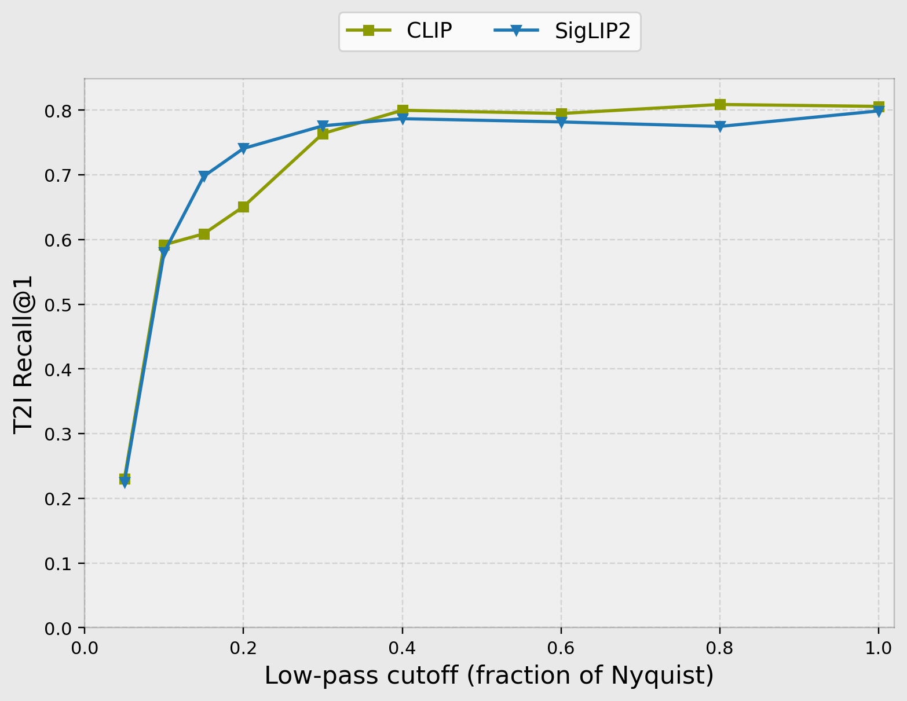

# The Prism Hypothesis: Harmonizing Semantic and Pixel Representations via Unified Autoencoding

<div class="is-size-5 publication-authors", align="center">
              <!-- Paper authors -->
                <span class="author-block">
                  <a href="https://weichenfan.github.io/Weichen//" target="_blank">Weichen Fan</a><sup>1</sup>,</span>
                  <span class="author-block">
                    <a href="https://paranioar.github.io/" target="_blank">Haiwen Diao</a><sup>1</sup>,</span>
                  <span class="author-block">
                  <a href="https://openreview.net/profile?id=~Quan_Wang6" target="_blank">Quan Wang</a><sup>2</sup>,</span>
                  <span class="author-block">
                  <a href="http://dahua.site/" target="_blank">Dahua Lin</a><sup>2</sup>,</span>
                  <span class="author-block">
                    <a href="https://liuziwei7.github.io/" target="_blank">Ziwei Liu</a><sup>1✉</sup>
                  </span>
                  </div>
<div class="is-size-5 publication-authors", align="center">
                    <span class="author-block">S-Lab, Nanyang Technological University<sup>1</sup> &nbsp;&nbsp;&nbsp;&nbsp; SenseTime Research <sup>2</sup> </span>
                    <span class="eql-cntrb"><small><br><sup>✉</sup>Corresponding Author.</small></span>
                  </div>

</p>

<div align="center">
                      <a href="https://arxiv.org/abs/2512.19693">Paper</a> | <a href="https://huggingface.co/weepiess2383/UAE">Weights</a> 
                      <!-- <a href="https://weichenfan.github.io/webpage-cfg-zero-star/">Project Page</a> |
                      <a href="https://huggingface.co/spaces/weepiess2383/CFG-Zero-Star">Demo</a> |
                      <a href="https://huggingface.co/spaces/jamesliu1217/EasyControl_Ghibli">Demo for Ghibli style</a> -->
</div>

---

<!-- 

[](https://hits.seeyoufarm.com)
[](https://huggingface.co/spaces/Vchitect/Vchitect-2.0)
[](https://huggingface.co/Vchitect/Vchitect-XL-2B) -->


## 🔥 Update and News
- [2026.3.25] New UAE model has been updated!

<div align="center">
  
</div>
<p align="center"><em>The new UAE pipeline without adding extra tokens for generative modeling.</em></p>

<div align="center">
  
</div>
<p align="center"><em>Flexible generative modeling supported by UAE.</em></p>

<div align="center">
  
</div>
<p align="center"><em>Reconstruction benchmarks on ImageNet-1K and MS-COCO 2017, showing strong image fidelity together with competitive semantic representation quality.</em></p>

<table align="center">
  <tr>
    <td align="center" width="50%">
      <br />
      <em>Pixel-space generative modeling.</em>
    </td>
    <td align="center" width="50%">
      <br />
      <em>Latent-space generative modeling.</em>
    </td>
  </tr>
</table>

## Installation
~~~bash
conda create -n uae python=3.10 -y
conda activate uae
pip install uv

uv pip install torch==2.2.0 torchvision==0.17.0 torchaudio --index-url https://download.pytorch.org/whl/cu121

uv pip install timm==0.9.16 accelerate==0.23.0 torchdiffeq==0.2.5 wandb
uv pip install "numpy<2" transformers einops omegaconf
uv pip install torchmetrics
~~~

## Model Preparation
~~~ bash
pip install huggingface_hub
hf download weepiess2383/UAE \
  --local-dir downloads 
~~~

## Quick evaluation
### 1. Unified-Autoencoder
~~~ bash
torchrun --standalone --nproc_per_node=8 src/stage1_sample_ddp.py \
  --config downloads/checkpoints/DINOv2-B/config.yaml \
  --data-path PATH_TO_IMAGENET_VALSET \
  --per-proc-batch-size 64 \
  --image-size 256 \
  --reference-npz-path downloads/data/val_ImageNet.npz \
  --sample-dir output/UEA_DINOv2-B/recon_samples_ImageNet \
  --metrics psnr,ssim,rfid

torchrun --standalone --nproc_per_node=8 src/stage1_sample_ddp.py \
  --config downloads/checkpoints/DINOv2-B/config.yaml \
  --data-path PATH_TO_MSCOCO2017_VALSET \
  --per-proc-batch-size 64 \
  --image-size 256 \
  --reference-npz-path downloads/data/val_COCO2017.npz \
  --sample-dir output/UEA_DINOv2-B/recon_samples_COCO \
  --metrics psnr,ssim,rfid
~~~
### 2. Generative Modeling
~~~ bash
torchrun --standalone --nnodes=1 --nproc_per_node=8 \
  src/sample_latent_modeling_ddp.py \
  --config configs/stage2/latent_modeling/sampling/ImageNet256/64token.yaml \
  --sample-dir samples \
  --precision fp32 \
  --label-sampling equal \
  --global-seed 42
~~~

## Training
### 1. Unified-Autoencoder Pretraining
```bash
# Stage-1
torchrun --standalone --nproc_per_node=N \
  src/train_stage1.py \
  --config PATH_TO_STAGE_1 (e.g configs/stage1/clip/stage1.yaml) \
  --data-path <imagenet_train_split> \
  --results-dir OUTPUT_PATH (e.g results/clip/stage1) \
  --image-size 256 --precision fp32 

# Stage-1-2
torchrun --standalone --nproc_per_node=N \
  src/train_stage1.py \
  --config PATH_TO_STAGE_1_2 (e.g configs/stage1/clip/stage2.yaml) \
  --data-path <imagenet_train_split> \
  --results-dir OUTPUT_PATH (e.g results/clip/stage) \
  --image-size 256 --precision fp32 
```
### 2. Generative Modeling
#### 2.1 Latent-Space Modeling

#### 2.2 Pixel-Space Modeling

## Preliminary Findings
~~~ bash
python analysis/retrival_exp.py \
  --data-path /path/to/imagenet/val \
  --text-template "the image of {}" \
  --topk 1 \
  --retrieval-filter-shape radial \
  --retrieval-radial-norm axis

python analysis/energy_exp.py \
  --data-path /path/to/imagenet/val \
  --output-file /path/to/output.png
~~~
More details could be find: prelim_analysis/README.md

<table align="center">
  <tr>
    <td align="center" width="50%">
      <br />
      <em>Energy Distributions.</em>
    </td>
    <td align="center" width="50%">
      <br />
      <em>Text-to-Image Retrival.</em>
    </td>
  </tr>
</table>

## BibTex
```
@misc{fan2025uae,
      title={The Prism Hypothesis: Harmonizing Semantic and Pixel Representations via Unified Autoencoding}, 
      author={Weichen Fan and Haiwen Diao and Quan Wang and Dahua Lin and Ziwei Liu},
      year={2025},
      eprint={2512.19693},
      archivePrefix={arXiv},
      primaryClass={cs.CV},
      url={https://arxiv.org/abs/2512.19693}, 
}
```
## Acknowledgement
The code is built upon the following repositories:
- [RAE](https://github.com/bytetriper/RAE): for the training and sampling framework.
- [DCTdiff](https://github.com/forever208/DCTdiff): for some frequency module implementations.

## ✨ Star History

[](https://www.star-history.com/#WeichenFan/UAE&type=date&legend=top-left)
